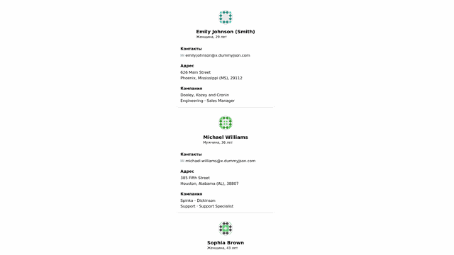

# Gaba Project: Просмотр Деталей Пользователя

**Ссылка на проект: [https://gaba-progect.vercel.app/](https://gaba-progect.vercel.app/)**

Этот проект представляет собой демонстрационное Next.js приложение, разработанное для отображения детальной информации о пользователях.

## Структура и описание проекта

Приложение состоит из трёх ключевых страниц:

-   **Главная страница (`/`)**: Отображает список карточек пользователей. Реализована динамическая пагинация (бесконечная прокрутка), которая подгружает новых пользователей по мере скролла.
-   **Страница пользователя (`/user/[id]`)**: Открывается при клике на карточку пользователя. Это динамическая страница, которая загружает и отображает подробную информацию о конкретном пользователе.
-   **Страница 404**: Кастомная страница для обработки несуществующих URL, что улучшает пользовательский опыт.

Проект демонстрирует следующие подходы:
-   **Динамическая маршрутизация** и обработка ошибок.
-   **Динамическая пагинация** (бесконечная прокрутка).
-   **Асинхронная загрузка данных** с помощью `fetch`.
-   **Компонентный подход** для переиспользуемых элементов UI.

## Используемые Технологии

-   **Next.js** (App Router)
-   **React**
-   **TypeScript**
-   **@heroui/react** для UI-компонентов
-   **Tailwind CSS** для стилизации
-   **ESLint** и **Prettier** для статического анализа и форматирования кода.
-   **Husky** для управления гит-хуками.

## Автоматизация и качество кода

### Husky (гит-хуки)

В проекте настроен **Husky** для автоматического контроля качества кода. Перед каждым коммитом (`pre-commit`) запускаются **ESLint** и **Prettier**. Это гарантирует, что в репозиторий попадает только отформатированный код, соответствующий стандартам проекта.

### GitHub Actions

Настроен workflow в **GitHub Actions**, который автоматически обновляет демонстрационную GIF-анимацию (`demo.gif`) в этом README. После каждого пуша в ветку `main`, Action заходит на развернутый сайт, записывает его работу и обновляет GIF-файл в репозитории. Это гарантирует, что демонстрация всегда актуальна.

## Начало Работы

Для запуска проекта на локальной машине выполните следующие шаги.

First, run the development server:

```bash
npm run dev
# or
yarn dev
# or
pnpm dev
# or
bun dev
```

Open [http://localhost:3000](http://localhost:3000) with your browser to see the result.

## Deploy on Vercel

The easiest way to deploy your Next.js app is to use the [Vercel Platform](https://vercel.com/new?utm_medium=default-template&filter=next.js&utm_source=create-next-app&utm_campaign=create-next-app-readme) from the creators of Next.js.

## Демонстрация Работы


